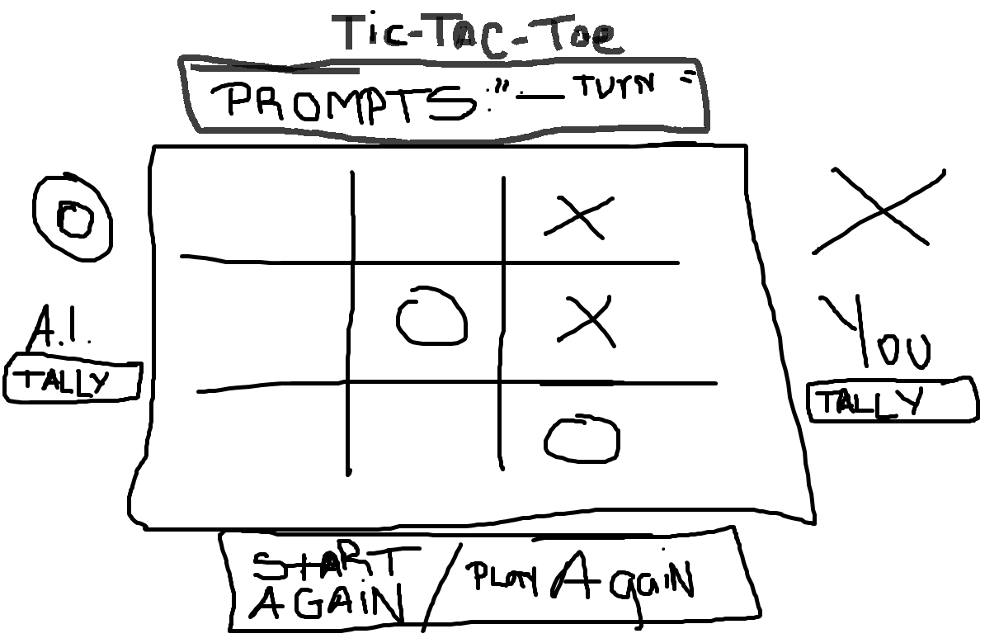

## Wireframe

## Pseudocode

1. Create a 3x3 grid to represent the tic-tac-toe board.
2. Create two players, X and O.
3. Set the human player to X.
    - Set the AI to O.
4. Initialize the game and display the game board.
5. Prompt the current player to make a move.
6. Validate the move:
    - Ensure the chosen cell is empty.
    - Ensure the chosen cell is within the valid range (1-9).
7. Update the board with the player's move.
8. Check if the current player has won:
    - Check rows, columns, and diagonals for three matching symbols.
    - If a winning condition is met, end the game and declare the who won as the winner.
9. Check if the game is a draw:
    - If all cells are filled and no player has won, end the game and declare it as a draw.
10. Switch the current player to the other player.
11. Display the final board state and the result of the game (winner or a tie).
12. End the game & Try Again option.

